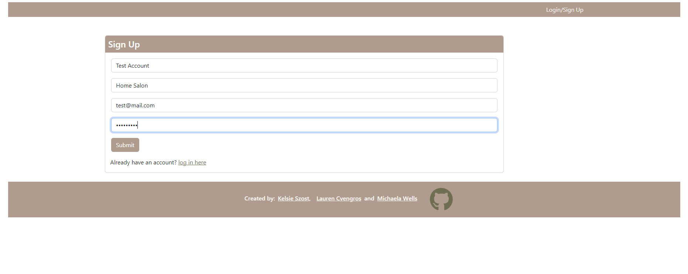
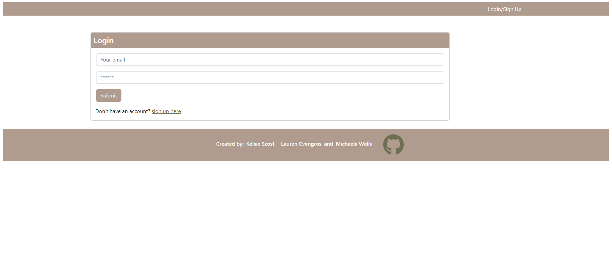
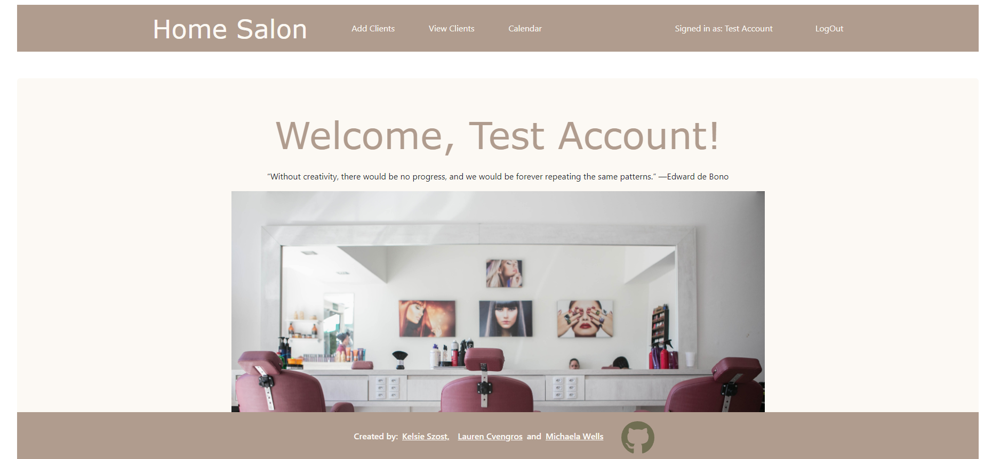
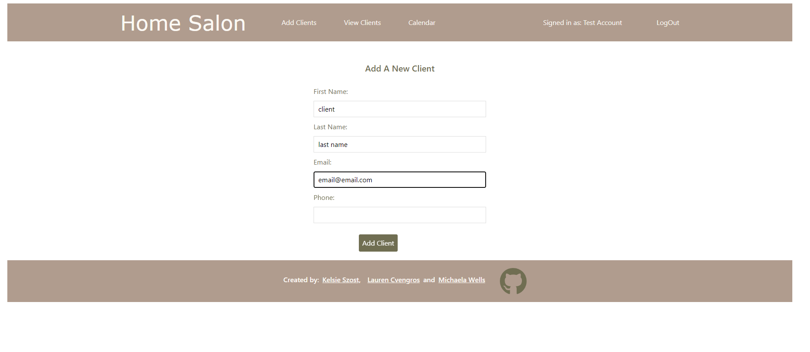
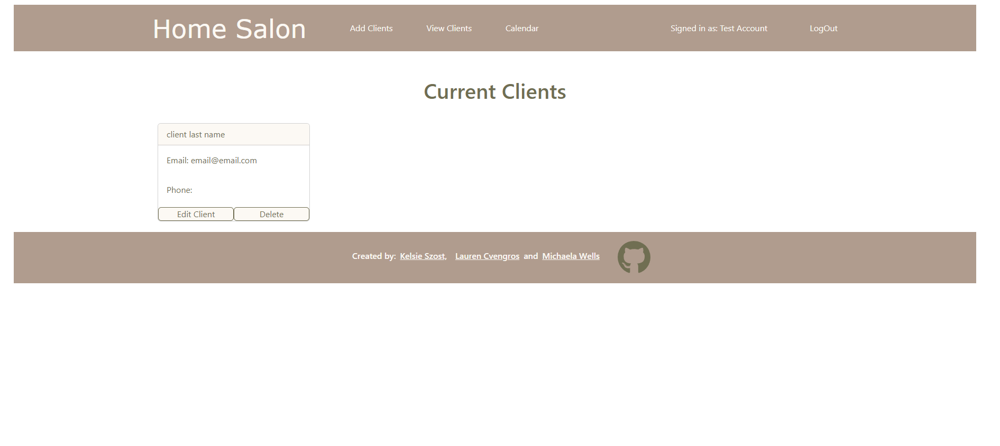

# Salon-CMS
[Deployed Salon-CMS App via Heroku](https://vast-shore-74918.herokuapp.com/)

## Table-of-Contents

1. [Description](#description)

2. [Installation](#installation)

2. [Technology](#technology)

3. [Photos](#photos)

4. [Collaborators](#Collaborators)


## Description:
The purpose of this application is to offer a website that small businesses can use to store all their client’s information, the already scheduled appointments, a glance at their monthly schedule and the ability to add new appointments.

The CMS application that we created is geared towards small business owners, this example specifically for a salon. There is log in / authentication required to use the appliation to keep all personal information safe from the prying eyes of the internet. Once the account owner has logged in you are able to view all your client's saved contact information, see their scheduled appointments and schedule then for an upcoming appointment as well. On the client's contact card you are able to edit any of the information or even delete their contact card if you wish to.

## Installation 

* To run this application follow these steps:

    ```
    1. clone the repository using https or SSH
    2. run npm i from the root folder
    3. run npm run develop from the root folder
    ```

## Technology:
- RESTful API using Node.js and Express.js
- React.js as the template engine
- Mongo for the database
- Authentication
- Deployment to Heroku

## Photos:
- View of the Sign Up Page:


- View of the Login Page:


- View of Main Page:


- View of the Add Clients:


- View of the View All Clients:


## Collaborators:

This application was developed and deployed by:

- Lauren Cvengros [l.cvengros@icloud.com]
- Kelsie Szost [owner@kelsieszost.design]
- Michaela Wells [mgwells012@gmail.com]